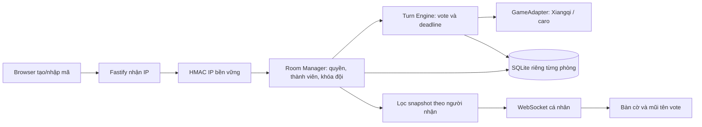

# Kiến trúc hiện hành: phòng theo IP

`src/rooms.ts` quản lý phòng, quyền và giới hạn; `src/room-server.ts` phục vụ HTTP/WS; `src/engine.ts` quản lý lượt. Metadata và engine được lưu cùng transaction SQLite, hỗ trợ savepoint và rollback. Một tiến trình sở hữu các phòng; không chạy nhiều replica cùng dữ liệu.

`registry.sqlite` giữ khóa HMAC IP; mỗi phòng một database. Backup toàn bộ ROOMS_PATH. Restart phục hồi đội/ban/bàn cờ; cửa sổ đang chơi được mở lại, deadline toàn trận vẫn giữ nguyên.

API: POST /api/rooms; POST /api/rooms/:code/join; GET /api/rooms/:code; POST các hậu tố name, team, request, vote, leave, host. WebSocket /ws/:code gửi snapshot đã lọc. Không nhận danh tính client tự khai. Mặc định bỏ qua X-Forwarded-For; TRUSTED_PROXY chỉ đặt IP/CIDR proxy thật. HTTP/WS dùng chung req.ip.

Node 24+, Fastify, TypeScript, Vite, SQLite, @fastify/websocket pin trong lockfile. Xiangqi luật dùng lengyanyu258/xiangqi.js commit f9019ac2303d4b80ef0b82fd0515bfb55a80a62b (BSD-2-Clause), renderer dùng lengyanyu258/xiangqiboardjs commit c36e1046c424e7abf1405904006043f6426b8ee8 (MIT). Caro 3x3 dùng cùng engine. Luật lặp thế/đuổi quân giải đấu chưa được chứng nhận đầy đủ.
