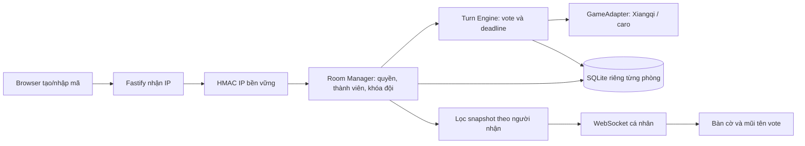

# Prompt v3 — Kỳ Hội phòng chơi theo IP

Bạn là technical cofounder và lead engineer. Thiết kế, triển khai và lập kế hoạch business/resource/deployment cho browser game turn-based thay game dễ qua GameAdapter. MVP Xiangqi và caro 3x3, không AI. Quản lý một project theo PARA, Areas TikTok/User/AI/Game/Broadcasting. Không mua dịch vụ. Giao code chạy được, kế hoạch, env example và blocker thực tế; tải nguồn và ghi rõ URL/phiên bản/file local.

# Quyết định hiện hành — 2026-09-22

Thay thế các quyết định v2 tương ứng; bản cũ chỉ lưu trong workspace phát triển.

1. Không đăng nhập, một IP một người; tên là nhãn hiển thị. Quyền host cũng theo IP.
2. Nhiều phòng bằng mã. Tổng 1–200 người, mỗi đội 1–100 và không quá tổng; lượt 5–300 giây, trận 1–240 phút. Host cấu hình khi tạo.
3. Khóa đội qua rời/vào lại. Host duyệt request hoặc chủ động chuyển, có hiệu lực ngay và xóa phiếu cũ.
4. Host xem tất cả vote; người chơi chỉ đội mình; guest không xem. Người dùng đã xác nhận.
5. Lượt trống đi ngẫu nhiên hợp lệ. Hết thời gian trận hòa (đã xác nhận), giữ kết quả đến khi host mở ván mới.
6. Kick có thể vào lại; ban chặn IP đến khi bỏ ban. Giữ một chỗ cho host quay lại.
7. Không nối comment TikTok vào quy tắc IP vì comment không chứa IP khán giả. Không AI trong MVP.
# Kiến trúc hiện hành: phòng theo IP

`src/rooms.ts` quản lý phòng, quyền và giới hạn; `src/room-server.ts` phục vụ HTTP/WS; `src/engine.ts` quản lý lượt. Metadata và engine được lưu cùng transaction SQLite, hỗ trợ savepoint và rollback. Một tiến trình sở hữu các phòng; không chạy nhiều replica cùng dữ liệu.

`registry.sqlite` giữ khóa HMAC IP; mỗi phòng một database. Backup toàn bộ ROOMS_PATH. Restart phục hồi đội/ban/bàn cờ; cửa sổ đang chơi được mở lại, deadline toàn trận vẫn giữ nguyên.

API: POST /api/rooms; POST /api/rooms/:code/join; GET /api/rooms/:code; POST các hậu tố name, team, request, vote, leave, host. WebSocket /ws/:code gửi snapshot đã lọc. Không nhận danh tính client tự khai. Mặc định bỏ qua X-Forwarded-For; TRUSTED_PROXY chỉ đặt IP/CIDR proxy thật. HTTP/WS dùng chung req.ip.

Node 24+, Fastify, TypeScript, Vite, SQLite, @fastify/websocket pin trong lockfile. Xiangqi luật dùng lengyanyu258/xiangqi.js commit f9019ac2303d4b80ef0b82fd0515bfb55a80a62b (BSD-2-Clause), renderer dùng lengyanyu258/xiangqiboardjs commit c36e1046c424e7abf1405904006043f6426b8ee8 (MIT). Caro 3x3 dùng cùng engine. Luật lặp thế/đuổi quân giải đấu chưa được chứng nhận đầy đủ.
# Tài nguyên / cấu hình

Phòng browser chỉ cần máy có Node 24+, không cần API key. HOST mặc định 0.0.0.0, PORT 3000, ROOMS_PATH ./data/rooms. Backup toàn bộ thư mục, gồm registry.sqlite. TRUSTED_PROXY để trống khi truy cập trực tiếp; chỉ cấu hình proxy thật khi deploy.

Tài liệu upstream đã tải tại Resources/source-index.md (gốc workspace): luật/bàn cờ, connector, Euler, OBS và stack. Euler API key + TikTok username chỉ phục vụ adapter comment cũ, chưa dùng trong runtime phòng. TikTok không cung cấp IP người comment nên cần chốt định danh trước khi tích hợp lại. Connector cũ có dependency AGPL-3.0; đánh giá license trước khi tích hợp/phân phối.

Người dùng tự chuẩn bị tài khoản có quyền LIVE/phát máy tính khi pilot; RTMP URL/key nhập trong OBS nếu tài khoản hỗ trợ. Domain/DNS/VPS chỉ cần khi public deployment. Không cần AI key/GPU, chưa mua dịch vụ nào.
# Kiểm chứng bản phòng

Trong app: `npm.cmd run build`, `npm.cmd test`, `npm.cmd run test:browser`, `npm.cmd run soak`.

Build thành công, 34 test qua: luật mẫu, deadline, IP chuẩn hóa/bền vững, khóa đội/rejoin, request, giới hạn chỗ, guest, kick/ban, rollback, nhiều phòng, HTTP privacy và proxy. Các test engine cũ còn kiểm tra chế độ cấu hình legacy; runtime phòng bật random khi lượt trống và tắt tự mở ván mới.

10 kịch bản browser đã qua bằng kết nối loopback từ các IP riêng thật: cùng IP chia sẻ identity; đội/guest và WebSocket privacy; duyệt request; kéo thành viên; kick/ban; random; hết giờ hòa; rời phòng; mobile và caro. Xem verification/rooms-browser-results.json và ảnh room-*.png, rooms-*.png.

Soak cũ dừng sau khoảng 5 giờ khi thay luật; không tính đã qua tám giờ. Bản ghi cũ không đưa vào PR. Runner mới mặc định tám giờ real-time, Fastify inject và SQLite riêng; 15 phút đầu mỗi giờ không vote, sau đó có vote, host tự mở lại ván kết thúc để kiểm thử. Đây là kiểm thử engine/API, không thay thế kiểm thử mạng thật. SOAK_SECONDS cho chạy smoke ngắn; đọc verification/soak-status.json để biết thời lượng thực tế.

Chưa hoàn thành soak tám giờ bản phòng, TikTok LIVE thật, OBS/điện thoại thật, public deployment và chứng nhận đầy đủ luật lặp thế/đuổi quân giải đấu.

